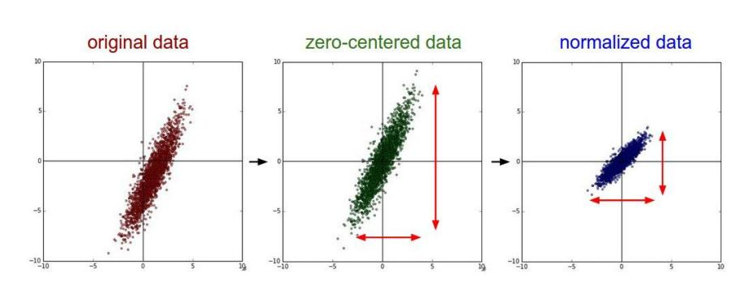

学习笔记

# [卷积神经网络概念与原理](https://blog.csdn.net/yunpiao123456/article/details/52437794)
# 一. 卷积神经网络
卷积神经网络（Convolutional Neural Networks, CNN）是一类包含卷积计算且具有深度结构的前馈神经网络，是深度学习的代表算法之一。
1998年LeNet-5在手写数字的识别问题中取得的成功使卷积神经网络的应用得到关注，微软在2003年使用卷积神经网络开发了光学字符读取（Optical Character Recognition, OCR）系统。
但是这个模型在后来的一段时间并未能火起来，主要原因是费机器（当时没有GPU），而且其他的算法（SVM等）也能达到类似的效果甚至超过。
随着ReLU和dropout的提出，以及GPU和大数据带来的历史机遇，CNN在2012年迎来了历史突破–AlexNet.
2012年，Hinton的学生Alex Krizhevsky在寝室用GPU死磕了一个Deep Learning模型，一举摘下了视觉领域竞赛ILSVRC 2012的桂冠，在百万量级的ImageNet数据集合上，效果大幅度超过传统的方法，从传统的70%多提升到80%多。
这个Deep Learning模型就是后来大名鼎鼎的AlexNet模型。AlexNet的成功主要由以下三个方面的原因：
1. 大量数据，李飞飞团队开源了大的标注数据集合ImageNet；
2. GPU，这种高度并行的计算神器确实助了洪荒之力，没有神器在手，Alex估计不敢搞太复杂的模型；
3. 算法的改进，包括网络变深、数据增强、ReLU、Dropout等。

自此，Deep Learning一发不可收拾，ILSVRC每年都不断被Deep Learning刷榜。
以下是ILSVRC竞赛2012年开始冠军队伍用的几大模型：

卷积神经网络与普通[神经网络](http://deeplearning.stanford.edu/wiki/index.php/%E7%A5%9E%E7%BB%8F%E7%BD%91%E7%BB%9C)的区别在于，卷积神经网络包含了一个由卷积层和子采样层构成的特征抽取器。在卷积神经网络的卷积层中，一个神经元只与部分邻层神经元连接。在CNN的一个卷积层中，通常包含若干个特征平面(featureMap)，每个特征平面由一些矩形排列的的神经元组成，同一特征平面的神经元共享权值，这里共享的权值就是卷积核。卷积核一般以随机小数矩阵的形式初始化，在网络的训练过程中卷积核将学习得到合理的权值。共享权值（卷积核）带来的直接好处是减少网络各层之间的连接，同时又降低了过拟合的风险。子采样也叫做池化（pooling），通常有均值子采样（mean pooling）和最大值子采样（max pooling）两种形式。子采样可以看作一种特殊的卷积过程。卷积和子采样大大简化了模型复杂度，减少了模型的参数。卷积神经网络的基本结构如图所示：

卷积神经网络的层级结构：
- 数据输入层/ Input layer
- 卷积计算层/ CONV layer
- ReLU激励层 / ReLU layer
- 池化层 / Pooling layer
- 全连接层 / FC layer

## 1. 数据输入层
数据输入层主要对原始图像做处理，其中包括：
- 去均值
- 归一化
- PCA/白化
### 1. 去均值
把输入数据各个维度都中心化为0，如下图所示，其目的就是把样本的中心拉回到坐标系原点上。
### 2. 归一化
幅度归一化到同样的范围，如下所示，即减少各维度数据取值范围的差异而带来的干扰，比如，我们有两个维度的特征A和B，A范围是0到10，而B范围是0到10000，如果直接使用这两个特征是有问题的，好的做法就是归一化，即A和B的数据都变为0到1的范围。

去均值与归一化效果图：

### 3. PCA/白化
用PCA降维；白化是对数据各个特征轴上的幅度归一化

去相关与白化效果图：

## 2. 隐含层
卷积神经网络的隐含层包含卷积层、池化层和全连接层3类常见构筑，在一些更为现代的算法中可能有Inception模块、残差块（residual block）等复杂构筑。在常见构筑中，卷积层和池化层为卷积神经网络特有。卷积层中的卷积核包含权重系数，而池化层不包含权重系数，因此在文献中，池化层可能不被认为是独立的层。以LeNet-5为例，3类常见构筑在隐含层中的顺序通常为：输入-卷积层-池化层-卷积层-池化层-全连接层-输出。
### 1. 卷积层
1. 卷积
    >图像中不同数据窗口的数据和卷积核（一个滤波矩阵）作内积的操作叫做卷积。其计算过程又称为滤波（filter)，本质是提取图像不同频段的特征。
2. 卷积核
    >卷积层的功能是对输入数据进行特征提取，其内部包含多个卷积核，组成卷积核的每个元素都对应一个权重系数和一个偏差量（bias vector），类似于一个前馈神经网络的神经元（neuron）。卷积层内每个神经元都与前一层中位置接近的区域的多个神经元相连，区域的大小取决于卷积核的大小，在文献中被称为“感受野（receptive field）”。 
     一个卷积核的滤波可以用来提取特定的特征（例如可以提取物体轮廓、颜色深浅等）。通过卷积层从原始数据中提取出新的特征的过程又成为feature map(特征图)。filter_size是指filter的大小，例如3\*3； 
      filter_num是指每种filter_size的filter个数，通常是通道个数
3. 卷积层
    >多个滤波器叠加便成了卷积层
4. 卷积层的参数
    >卷积层参数包括卷积核大小、步长和填充，三者共同决定了卷积层输出特征图的尺寸，是卷积神经网络的超参数。
      其中卷积核大小可以指定为小于输入图像尺寸的任意值，卷积核越大，可提取的输入特征越复杂。
      卷积步长定义了卷积核相邻两次扫过特征图时位置的距离，卷积步长为1时，卷积核会逐个扫过特征图的元素，步长为n时会在下一次扫描跳过n-1个像素。
      填充是在特征图通过卷积核之前人为增大其尺寸以抵消计算中尺寸收缩影响的方法。常见的填充方法为按0填充和重复边界值填充
5. 通道
    >通道可以理解为视角、角度。例如同样是提取边界特征的卷积核，可以按照R、G、B三种元素的角度提取边界，RGB在边界这个角度上有不同的表达；再比如需要检查一个人的机器学习能力，可以从特征工程、模型选择、参数调优等多个方面检测

卷积层的主要特征:
- 局部感知

    - 在传统的神经网络中，每个神经元都与图片上的每一个像素相连接，这样会造成权重参数数量巨大而无法训练。 
    - 一般认为图像的空间联系是局部的像素联系比较密切，而距离较远的像素相关性较弱，因此，每个神经元没必要对全局图像进行感知，只要对局部进行感知，然后在更高层将局部的信息综合起来得到全局信息。 
    - 在卷积神经网络中，每个神经元的权重个数都是卷积核的大小，这就相当于每个神经元只与部分像素相连接,这样就极大的减少了权重的数量。
    
    
- 权值共享
    
    权值共享实际上就是局部感知的部分，用一个卷积核从一个局部区域学习到的信息，应用到图像的其它地方去。即用该卷积核去卷积整张图，生成的feature map的每一个像素值都是由这个卷积核产生的，这就是权值共享。

 
    

- 多核卷积

    一个卷积核操作只能得到一部分特征可能获取不到全部特征，这么一来我们就引入了多核卷积。用每个卷积核来学习不同的特征（每个卷积核学习到不同的权重）来提取原图特征。

下面的动态图形象地展示了卷积层的计算过程：
    

### 2. 激励函数

    >卷积层中包含激励函数以协助表达复杂特征
    如果不使用非线性激活函数，那么每一层输出都是上层输入的线性组合；
    增加模型的非线性表达能力, 加强网络的表示能力，解决线性模型无法解决的问题
参考：
- [激活函数](https://blog.csdn.net/u014088052/article/details/50923924)
- [常用激活函数（激励函数）理解与总结](https://blog.csdn.net/tyhj_sf/article/details/79932893)
    
### 3. 池化层
    主要分平均池化和最大池化。
    进行下采样可以利用局部相关性可以减少后续的数据处理量，同时又保留有用信息。

### 4. [全连接层](https://zhuanlan.zhihu.com/p/33841176)
    把特征representation整合到一起，输出为一个值,就大大减少特征位置对分类带来的影响
    全连接层之前的作用是提取特征,全理解层的作用是分类
在实际应用中，往往使用多层卷积，然后再使用全连接层进行训练，多层卷积的目的是一层卷积学到的特征往往是局部的，层数越高，学到的特征就越全局化

## 二. 卷积神经网络的训练
- 前向传播
- 反向传播

卷积神经网络中卷积层的权重更新过程本质是卷积核的更新过程。

## 三.卷积神经网络演变史

参考：
- [卷积神经网络-百度百科](https://baike.baidu.com/item/%E5%8D%B7%E7%A7%AF%E7%A5%9E%E7%BB%8F%E7%BD%91%E7%BB%9C/17541100?fr=aladdin)
- [卷积神经网络概念与原理](https://blog.csdn.net/yunpiao123456/article/details/52437794)
- [从AlexNet理解卷积神经网络的一般结构](https://blog.csdn.net/qq_30868235/article/details/80465722)
- [卷积神经网络CNN总结](https://www.cnblogs.com/skyfsm/p/6790245.html)
- [什么是全连接层](https://zhuanlan.zhihu.com/p/33841176)
- [CNN网络架构演进：从LeNet到DenseNet](https://www.cnblogs.com/skyfsm/p/8451834.html)
- [CNN详解（卷积层及下采样层）](https://blog.csdn.net/baidu_14831657/article/details/60570765)

# 目标检测：
## Faster-RCNN:

### 1. 特征抽取
    通过卷积神经网络，如VGG-16，抽取特征，获取FeatureMap
### 2. RPN（RegionProposal Network， 区域生成网络）
    2.1 生成anchors，FeatureMap的每个点生成k个anchors
    2.2 用3*3的卷积核对上一步骤得到的FeatureMap做卷积计算，加入附近像素的信息
    2.3 分两路，一路用来判断候选框是前景还是背景，另一路用来确定候选框的位置
    2.3.1 用2k个卷积核对FeatureMap做卷积，得到2k个FeatureMap，先reshape成一维向量，然后softmax来判断是前景还是背景，然后reshape恢复为二维feature map
    2.3.2 # 用4k个1 * 1 * 512 的卷积核卷积，最后输出4k个数，这里的4是一个建议框的参数，即(x, y, w, h)  
    2.4 根据anchor的概率（rpn_cls_prob）和位置（bbox_pred）选出rois：按照前景概率得分筛出前TopN个bbox，再通过NMS后保留前TopN2 个bbox 
### 3. ROI Pooling层
    解决之前得到的proposal大小形状各不相同，导致没法做全连接
### 4. 分类层
    ROI Pooling层后的特征图，通过全连接层与softmax，就可以计算属于哪个具体类别，比如人，狗，飞机，并可以得到cls_prob概率向量。同时再次利用bounding box regression精细调整proposal位置，得到bbox_pred，用于回归更加精确的目标检测框。
    这样就完成了faster R-CNN的整个过程了。算法还是相当复杂的，对于每个细节需要反复理解。faster R-CNN使用resNet101模型作为卷积层，在voc2012数据集上可以达到83.8%的准确率，超过yolo ssd和yoloV2。其最大的问题是速度偏慢，每秒只能处理5帧，达不到实时性要求。

参考：
- [目标检测算法综述：R-CNN，faster R-CNN，yolo，SSD，yoloV2](https://www.imooc.com/article/37757)