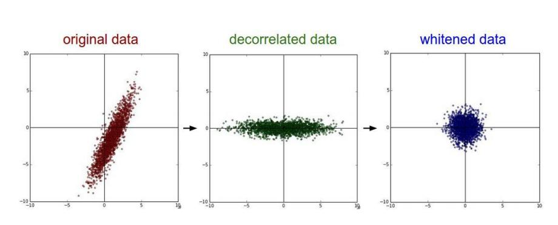
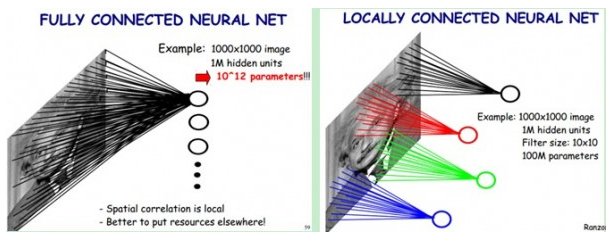
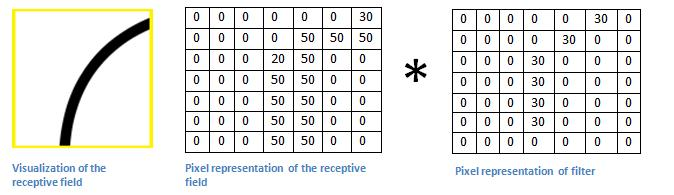

# 一.问题概述
图像分类主要是对输入的图片判定为特定类别（例如一只猫或者狗等）或者可能性最大的类别。
  对我们人类而言，当我们看到图片或者是周围的世界时，我们可以立刻描绘出场景的特征，并给每个物体贴上标签，这是因为我们从出生起就一直在学习、识别、归纳。
  而这些迅速识别模式、归纳知识以及适应不同图像与环境的技能一直是机器难以拥有的。

# 二. 输入与输出
当电脑看见一张图像（把图像作为输入），它实际上看到的是一个由像素值组成的数组。基于分辨率和图像的大小，它会看到一个32 x 32 x 3的数组（3指的是RGB的值）。
  假设我们有一张JPG格式、大小为480 x 480的彩色图片，那么它对应的就是一个480 x 480 x 3的数组。数组中的每一个数字都是介于0到255之间的，这些数字代表像素在这一点的强度。尽管这些数字对于人类做图像分类是毫无意义的，它们却是电脑唯一能得到的输入信息。
  计算机识别图像的基本思路是，你把这个数组输入给电脑，它就会输出一个数字，代表该图像属于某一特定分类的概率（例如，80%的概率是猫，15%的概率是狗，5%的概率是鸟）。

# 三. 计算机的任务
我们希望计算机能够区分开我们输入的所有图像，并且识别出其独特的特征，比如哪些特征是狗特有的，哪些是猫特有的。
  当我们观察狗的图片时，我们会在图片中寻找可识别的特征，例如爪子或者4条腿，这样我们就能将它正确地分类。
  同样的，通过寻找例如边缘和曲线之类的底层特征，并通过一系列的卷积层建立一个更加抽象的概念，电脑也能进行图像分类。这是CNN工作原理的概览。

# 四. 卷积神经网络
CNN所需做的是，拿到图像，输入一系列卷积、非线性、池化（下采样）和完全连接的层中，最终得到一个输出。
  输出可以是能最好描述图的分类的一个单一结果或者一组分类的概率。

卷积神经网络的层级结构：
- 数据输入层/ Input layer
- 卷积计算层/ CONV layer
- ReLU激励层 / ReLU layer
- 池化层 / Pooling layer
- 全连接层 / FC layer
- 输出层

## 1. 数据输入层
数据输入层主要对原始图像做处理，其中包括：
- 去均值
- 归一化
- PCA/白化
### 1. 去均值
把输入数据各个维度都中心化为0，如下图所示，其目的就是把样本的中心拉回到坐标系原点上。
### 2. 归一化
幅度归一化到同样的范围，如下所示，即减少各维度数据取值范围的差异而带来的干扰，比如，我们有两个维度的特征A和B，A范围是0到10，而B范围是0到10000，如果直接使用这两个特征是有问题的，好的做法就是归一化，即A和B的数据都变为0到1的范围。

去均值与归一化效果图：

### 3. PCA/白化
用PCA降维；白化是对数据各个特征轴上的幅度归一化

去相关与白化效果图：

## 2. 隐含层
卷积神经网络的隐含层包含卷积层、池化层和全连接层3类常见构筑，在一些更为现代的算法中可能有Inception模块、残差块（residual block）等复杂构筑。在常见构筑中，卷积层和池化层为卷积神经网络特有。卷积层中的卷积核包含权重系数，而池化层不包含权重系数，因此在文献中，池化层可能不被认为是独立的层。以LeNet-5为例，3类常见构筑在隐含层中的顺序通常为：输入-卷积层-池化层-卷积层-池化层-全连接层-输出。
### 1. 卷积层
1. 卷积
    >图像中不同数据窗口的数据和卷积核（一个滤波矩阵）作内积的操作叫做卷积。其计算过程又称为滤波（filter)，本质是提取图像不同频段的特征。
2. 卷积核
    >卷积层的功能是对输入数据进行特征提取，其内部包含多个卷积核，组成卷积核的每个元素都对应一个权重系数和一个偏差量（bias vector），类似于一个前馈神经网络的神经元（neuron）。卷积层内每个神经元都与前一层中位置接近的区域的多个神经元相连，区域的大小取决于卷积核的大小，在文献中被称为“感受野（receptive field）”。 
     一个卷积核的滤波可以用来提取特定的特征（例如可以提取物体轮廓、颜色深浅等）。通过卷积层从原始数据中提取出新的特征的过程又成为feature map(特征图)。filter_size是指filter的大小，例如3\*3； 
      filter_num是指每种filter_size的filter个数，通常是通道个数
3. 卷积层
    >多个滤波器叠加便成了卷积层
4. 卷积层的参数
    >卷积层参数包括卷积核大小、步长和填充，三者共同决定了卷积层输出特征图的尺寸，是卷积神经网络的超参数。
      其中卷积核大小可以指定为小于输入图像尺寸的任意值，卷积核越大，可提取的输入特征越复杂。
      卷积步长定义了卷积核相邻两次扫过特征图时位置的距离，卷积步长为1时，卷积核会逐个扫过特征图的元素，步长为n时会在下一次扫描跳过n-1个像素。
      填充是在特征图通过卷积核之前人为增大其尺寸以抵消计算中尺寸收缩影响的方法。常见的填充方法为按0填充和重复边界值填充
5. 通道
    >通道可以理解为视角、角度。例如同样是提取边界特征的卷积核，可以按照R、G、B三种元素的角度提取边界，RGB在边界这个角度上有不同的表达；再比如需要检查一个人的机器学习能力，可以从特征工程、模型选择、参数调优等多个方面检测

卷积层的主要特征:
- 局部感知

    - 在传统的神经网络中，每个神经元都与图片上的每一个像素相连接，这样会造成权重参数数量巨大而无法训练。 
    - 一般认为图像的空间联系是局部的像素联系比较密切，而距离较远的像素相关性较弱，因此，每个神经元没必要对全局图像进行感知，只要对局部进行感知，然后在更高层将局部的信息综合起来得到全局信息。 
    - 在卷积神经网络中，每个神经元的权重个数都是卷积核的大小，这就相当于每个神经元只与部分像素相连接,这样就极大的减少了权重的数量。
    
    
- 权值共享
    
    权值共享实际上就是局部感知的部分，用一个卷积核从一个局部区域学习到的信息，应用到图像的其它地方去。即用该卷积核去卷积整张图，生成的feature map的每一个像素值都是由这个卷积核产生的，这就是权值共享。

 
    

- 多核卷积

    一个卷积核操作只能得到一部分特征可能获取不到全部特征，这么一来我们就引入了多核卷积。用每个卷积核来学习不同的特征（每个卷积核学习到不同的权重）来提取原图特征。

下面的动态图形象地展示了卷积层的计算过程：

每一个过滤器都可以看做为一个特征标识器。
  这里的特征是指直线、简单的颜色以及曲线之类的东西，这些都是图片所共有的最简单特征。
  假设我们有一个7\*7\*1的过滤器。
  曲线检测器有一定的像素结构，在该结构中，沿着曲线形状的区域将具有更高的数值。

左- 过滤器的像素化表现  ,     右-可视化的曲线检测过滤器

如果输入图片的形状与过滤器所表现的曲线相类似，那么我们的乘积的和会是一个很大的数值。
 （50\*30）+（50\*30）+（50\*30）+（20\*30） +（50\*30）=6600

  若输入图片的形状与过滤器表现的曲线没有拟合，那么乘积就很小，如上图，其乘积就为0。
  这个值相比上一个要低很多！这是因为图片中没有任何部分与曲线检测过滤器对应。
  这个卷积层的输出是一个激活映射。在这个只有一个过滤器（并且这个过滤器是曲线检测器）的卷积的案例中，激活映射会显示出图片中那些与过滤器的曲线相类似的区域。
  该示例中，28 x 28 x 1的激活映射的左上角的值将为6600。这个很高的值意味着输入中包含着某种类型的曲线激活了过滤器。
 激活映射的右上角的值是0，因为所输入的值并没有激活过滤器。（或者更简单的说，图片的右上角没有这样一个曲线）。
  这仅仅是一个过滤器，一个可以检测出向右外侧的曲线的过滤器。我们可以拥有更多的过滤器，如向左的曲线或者直线。过滤器越多，激活映射的深度越深，我们从输入中取得的信息也就越多。

### 2. 激励函数
>神经网络中的每个神经元节点接受上一层神经元的输出值作为本神经元的输入值，并将输入值传递给下一层，输入层神经元节点会将输入属性值直接传递给下一层（隐层或输出层）。在多层神经网络中，上层节点的输出和下层节点的输入之间具有一个函数关系，这个函数称为激活函数（又称激励函数）。
  如果不用激励函数（其实相当于激励函数是f(x) = x），在这种情况下你每一层节点的输入都是上层输出的线性函数，很容易验证，无论你神经网络有多少层，输出都是输入的线性组合，与没有隐藏层效果相当，这种情况就是最原始的感知机（Perceptron）了，那么网络的逼近能力就相当有限。正因为上面的原因，我们决定引入非线性函数作为激励函数，这样深层神经网络表达能力就更加强大（不再是输入的线性组合，而是几乎可以逼近任意函数）。

常见的激活函数有sigmod, relu等。
 Relu激活函数：

参考：
- [激活函数](https://blog.csdn.net/u014088052/article/details/50923924)
- [常用激活函数（激励函数）理解与总结](https://blog.csdn.net/tyhj_sf/article/details/79932893)
    
### 3. 池化层
>池化层主要用在连续的卷积层与激励层中间，用于压缩数据和参数的量，并减少过拟合，同时又保留有用信息。
 池化层的策略主要有max pooling和average pooling。下图展示的是max pooling的一个结果。

### 4. [全连接层](https://zhuanlan.zhihu.com/p/33841176)
>全连接层之前的作用是提取特征,全理解层的作用是分类
  全连接网络层作为神经网络的结束层。该层将之前层（卷积层、激活层或者池化层）的处理结果作为输入，并输出一个N维的向量，N是程序所选择的类别的数量。
  例如你想做一个数字识别程序，一共有10个数字，那么N就是10。这个N维向量中每一个数字表示了目标对象属于该类的概率值。例如，一个数字识别程序的结果向量是[0 .1 .1 .75 0 0 0 0 0 .05]，它的意思就是这个图片有10%的可能性是1, 10%的可能性是2, 75%的可能性是3，以及5%的可能性是9
  如果程序预测某张图像是一条猫，它就会在代表一个猫头、猫腿、猫尾巴等高级特征的激活映射中有较高的值。

参考：
- [CNN 入门讲解：什么是全连接层](https://zhuanlan.zhihu.com/p/33841176)

# 五. 卷积神经网络的训练
卷积神经网络的训练主要由前向传播和反向传播。
- 前向传播: 输入的样本从输入层经过隐单元一层一层进行处理，通过所有的隐层之后，传向输出层。
- 反向传播: 把误差信号按原来正向传播的通路反向传回，并对每个隐层的各个神经元的权系数进行修改，以使误差信号趋向最小。

卷积神经网络中卷积层的权重更新过程本质是卷积核的更新过程。

# 六. 演示
MNIST数据集是一个手写数字数据集，每一张图片都是0到9中的单个数字，图片大小是28*28，比如下面几个:

MNIST数据库的来源是两个数据库的混合,一个来自Census Bureau employees(SD-3),一个来自high-school students(SD-1)；
 有训练样本60000个，测试样本10000个。训练样本和测试样本中，employee和student写的都是各占一半。
 60000个训练样本一共大概250个人写的。训练样本和测试样本的来源人群没有交集。

参考：
- [反向传播算法推导-全连接神经网络](https://zhuanlan.zhihu.com/p/39195266)
- [CNN 入门讲解：图片在卷积神经网络中是怎么变化的（前向传播 Forward Propagation）](https://zhuanlan.zhihu.com/p/34222451)

